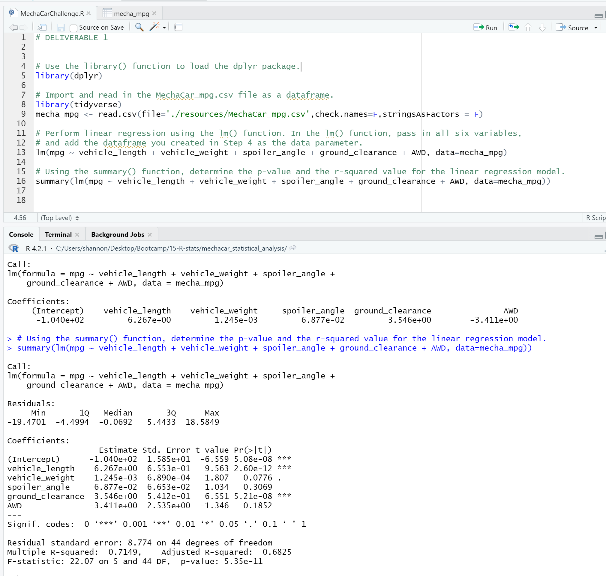
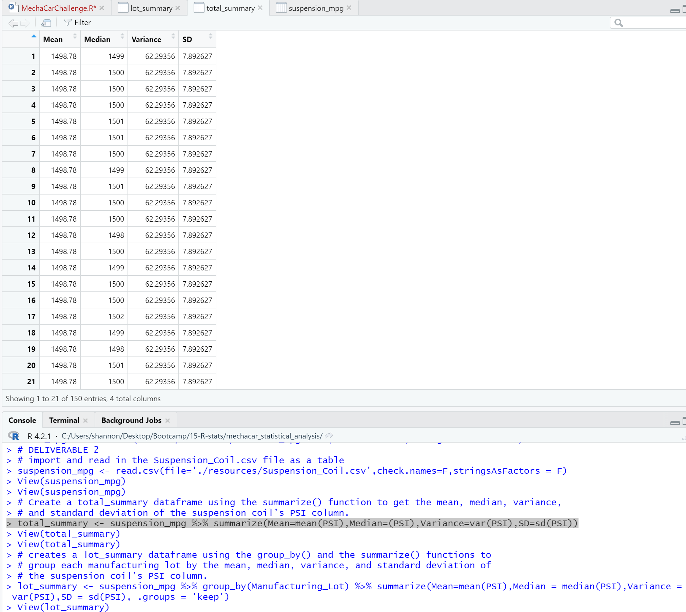
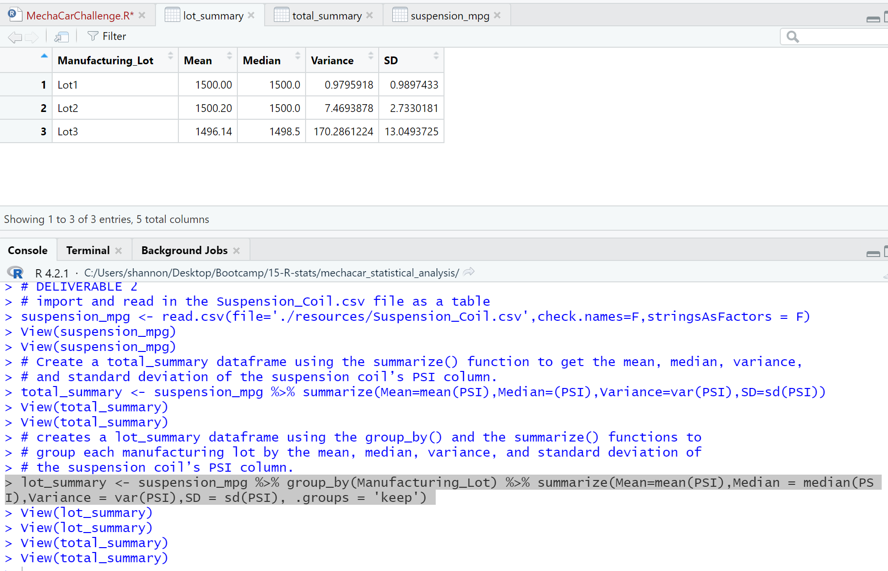
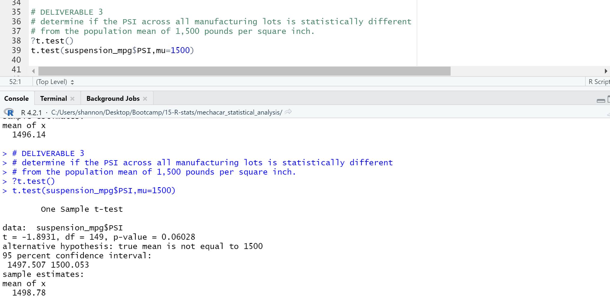
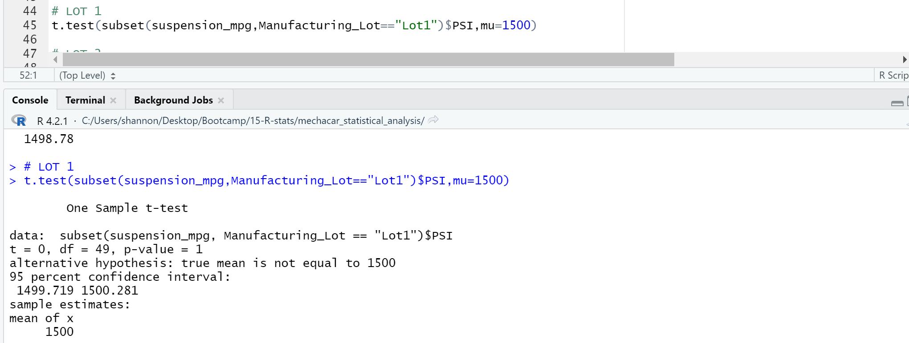
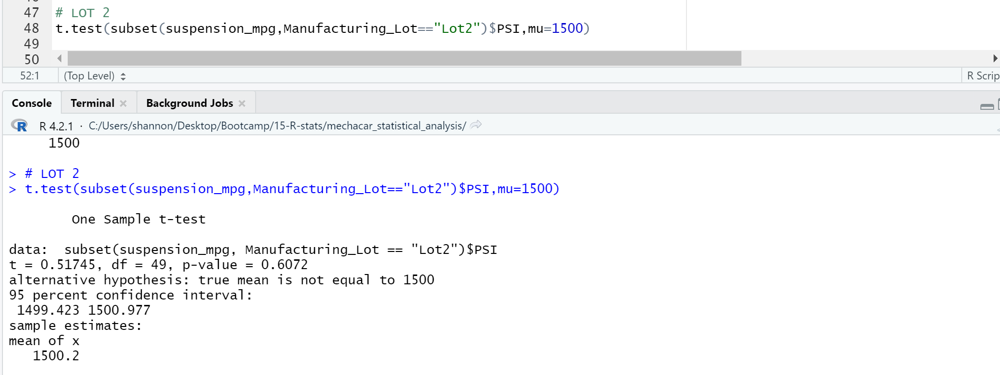
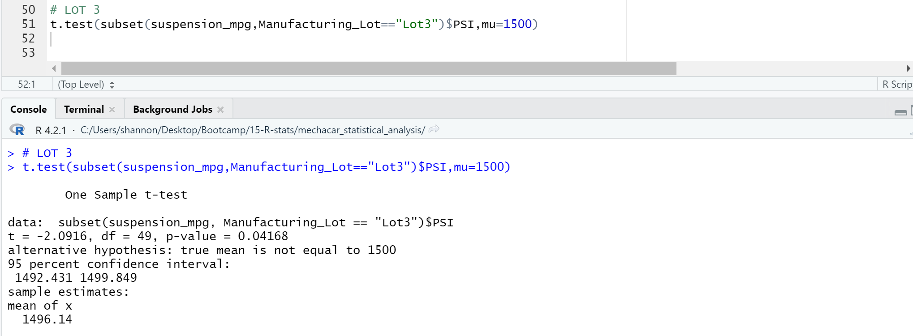

# MechaCar Statistical Analysis
## Overview
The purpose of this statistical analysis is to perform a multiple linear regression to identify which variables in the dataset predict the mpg of MechaCar prototypes, Collect summary statistics on the pounds per square inch (PSI) of the suspension coils from the manufacturing lots, run t-tests to determine if the manufacturing lots are statistically different from the mean population, and design a statistical study to compare vehicle performance of the MechaCar vehicles against vehicles from other manufacturers. The ultimate goal being to aid AutoRU improve their MechaCar prototype for maximum performance against the competition.

## Resources 
Software:
* RStudio
* R Script
* Packages: tidyverse, dplyr, ggplot2

Data: 
* MechaCar_mpg.csv
* Suspension_Coil.csv
## 1. Linear Regression to Predict MPG
The `MechaCar_mpg.csv` dataset used in the multiple linear regression, contains mpg test results for 50 prototype MechaCars. The dataset contains several metrics such as vehicle length, vehicle weight, spoiler angle, drivetrain, and ground clearance, were collected for each vehicle. 

___Linear Regression Results___

### Results
* The multiple linear regression shows the metrics for vehicle_weight, spoiler_angle, and AWD provide a non-random amount of variance.  
* The slope of the multiple linear regression is not considered to be zero because the p-value (5.35e-11) is less than 0.05%, the assumed level of significance. 
* The intersept value (5.08e-08) is statistically significant as well, which means it is possibile other variables not inlcuded in this model may contribute to the variation in mpg. Additional values may still need to be collected or observed to increase the power of the analysis predeiction. 
* This multiple regression model does predict mpg effectivly.  This is based on the r-squared value of .07149, which means 71% of the time, the predictions will be correct using this linear model.

## 2. Summary Statistics on Suspension Coils
The `Suspension_Coil.csv` dataset used in the summary statistics contains the results from multiple production lots. In this dataset, the weight capacities of multiple suspension coils were tested to determine if the manufacturing process is consistent across production lots.

The design specifications for the MechaCar suspension coils dictate that the variance of the suspension coils must not exceed 100 pounds per square inch. 

___Total Summary___

___Lot Summary___

### Results 
* The variance of the PSI sample distribution and the standard deviation are within the design specifications for all 3 lots and does not exceed 100 pounds PSI.  We know this because the mean (1498.78), variance (62.29356) and standard deviation (7.892627) are the same for all 150 entries in the dataframe and the median value varies between 1452 adn 1542.
* The results of the *Lot Summary* analysis on the 3 lots of suspension coils predict Lot 1 and Lot 2 meet design specification because the variance and standard deviation are under 100 pounds per square inch. 
* The prediction for Lot 3 does not meet design specifications because variance and standard deviation are greater than 100 pounds per square inch.

## 3. T-Tests on Suspension Coils
T-Test analysis was performed 4 times with the `Suspension_Coil.csv` dataset - for all lots and each individual lot. This is to determine if the manufacturing lots are statistically different from the presumed mean population.

___T-Test for All Lots___

___T-Test for Lot 1___

___T-Test for Lot 2___

___T-Test for Lot 3___

### Results 
* The _T-Test for All Lots_ analysis shows the p-value is 0.06028 which is outside the signifigance level of 0.05,  therefor we should accept the null hypothesis. In other words, the mean of all three of these manufacturing lots is statistically similar to the presumed population mean of 1500.
* the _T-Test for Lot 1_ analysis actually has a true sample mean of 1500, as we saw in the summary statistics earlier. With a p-Value of 1, clearly we cannot reject (i.e. accept) the null hypothesis that there is no statistical difference between the observed sample mean and the presumed population mean (1500).
* The _T-Test for Lot 2_ analysis has essentially the same outcome as Lot 1,  with a sample mean of 1500.02 and a p-Value of 0.61. Therefore the null hypothesis cannot be rejected.
* The _T-Test for Lot 3_ analysis however is a different scenario where the sample mean is 1496.14 and the p-Value is 0.04.  THis p-value is lower than the common significance level of 0.05, in which case the null hypothesis IS rejected.

## 4. Study Design: MechaCar vs Competition.
To aid AutoRU improve their MechaCar prototype for maximum performance against the competition, the proposed statistical study compares the performace of several metrics for MechaCar and its competitors.

### __What metric or metrics are you going to test?__
 Test whether or not the MechaCar has statistically significant differences in these metrics compared to the competitors models:
* city and highway fuel efficiency
* horsepower
* safety rating

### __What is the null hypothesis or alternative hypothesis?__

* _Null Hypothesis:_  There is no statistical difference between the horsepower and safety rating of the MechaCar prototype and competitors.

* _Alternative Hypothesis:_ There is a statistical difference between the horsepower and safety rating of the MechaCar prototype and competitors.
### __What statistical test would you use to test the hypothesis? And why?__
* An ANOVA test that looks at the statistical differences between the means of three or more independent groups, would be a good start. The test would need one dependent variable, like MPG. The other variables like horsepower and safety rating would be the independent variable specifications in this test and would compare the metrics of the different vehicles including the MechaCar prototype.
  
### __What data is needed to run the statistical test?__
In order to run these statistical tests, we would need data that inlcudes cost, fuel efficiency, horsepower, and safety rating from both MechaCar as well as the MechaCar's competitors.
